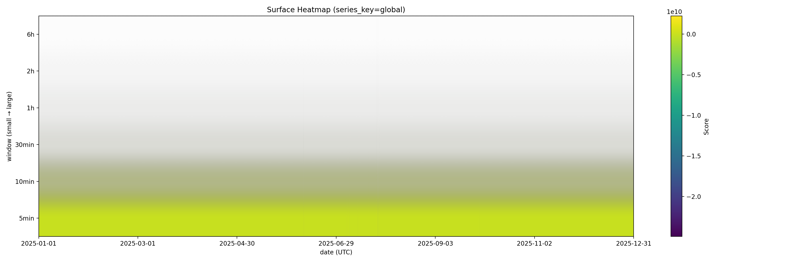

# Helix

Helix is a multi-resolution time-series analysis engine.

It generates windowed signal surfaces from timestamped data, enabling structured inspection of trends, scale-dependent behavior, and anomalies across time.

---

## Overview

Helix converts raw time-indexed data into a structured surface defined by:

- Time bins
- Window sizes
- Aggregated metrics
- Optional scoring overlays

The result is a long-form representation suitable for visualization, comparison across scales, and downstream analysis.

---

## Key Features

- Configurable window and hop definitions
- Multi-scale surface generation
- YAML-based configuration
- Pluggable scoring operators
- CLI-driven workflow
- Clear separation between engine code and generated outputs

---

## Example

The following heatmap is generated from:

- `examples/intermagnet/data/yellowknife_2025_01_01_to_09.csv`
- `examples/intermagnet/specs/demo_intermagnet.yaml`



---

## Usage

Generate a surface:

```
uv run helix surface   --spec examples/intermagnet/specs/demo_intermagnet.yaml   --events examples/intermagnet/data/yellowknife_2025_01_01_to_09.csv   --out outputs_surface
```

Generate a heatmap:

```
uv run helix heatmap   --csv outputs_surface/surface.csv   --out heatmap.png
```

---

## Repository Structure

```
src/        Engine source code
examples/   Example datasets and specifications
tests/      Smoke tests
```

Generated artifacts (outputs, logs, cache) are intentionally excluded from version control.

---

## Scope

Helix focuses on structured, window-based analysis of time-series data.  
It does not impose a domain, model, or interpretation layer.  
It provides the surface; interpretation is left to the user.

---

## License

MIT
